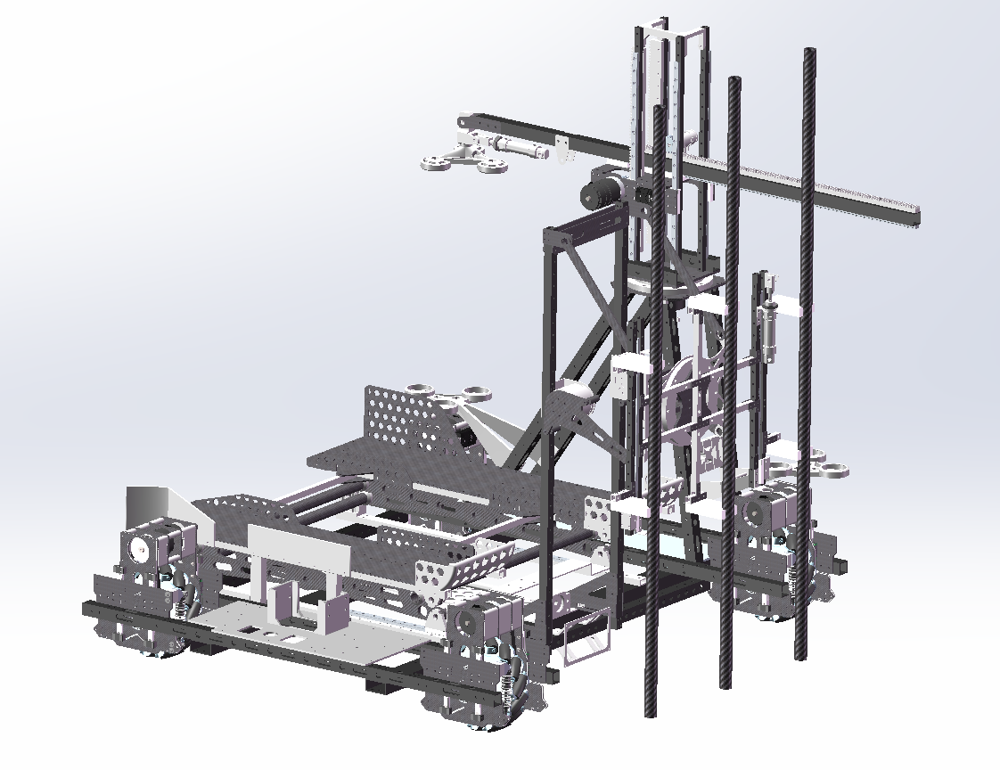
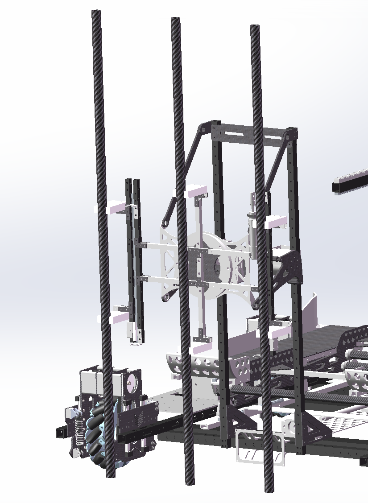
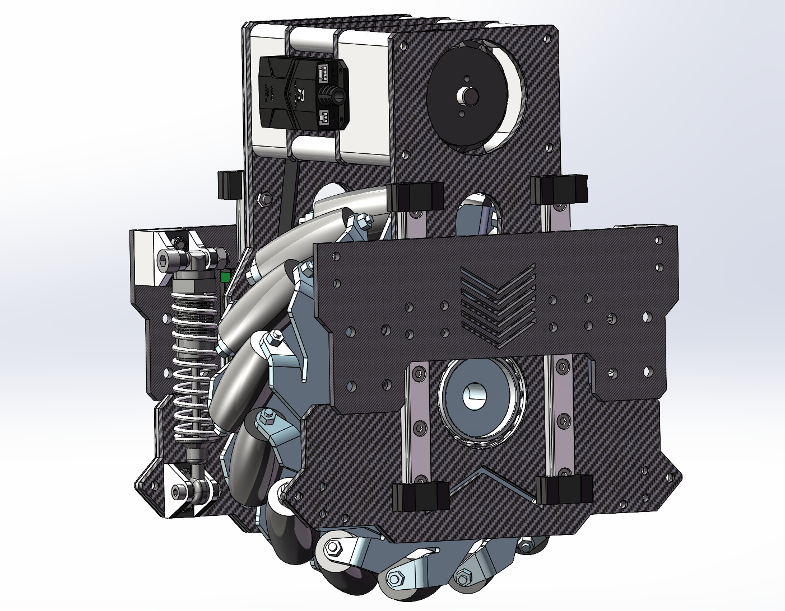
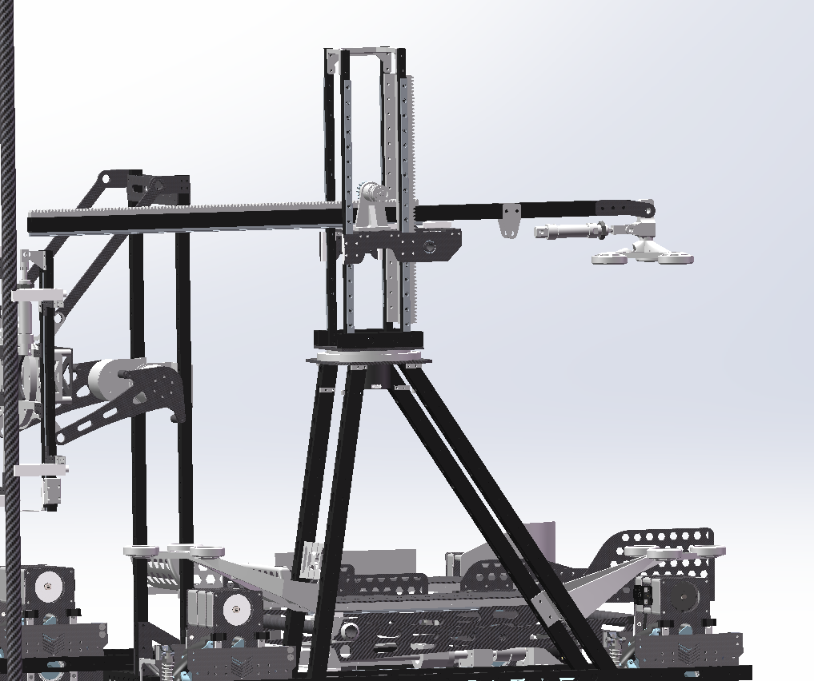
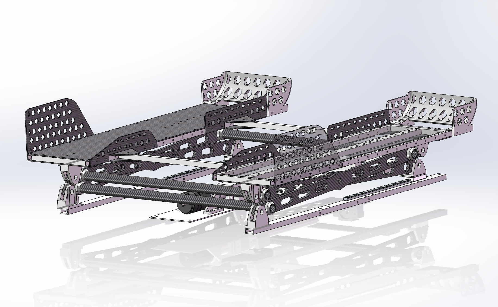

# 个人机器人机械作品集

> 宁波工程学院机器人工程本科生｜机械结构设计、建模与加工｜求机器人机械/结构设计实习

## 关于我

我是一名宁波工程学院机器人工程专业大三学生，专业排名前 30%。目前正在寻找机器人机械、机械结构设计和机电一体化方向的实习机会。

我主要负责竞赛机器人和科创项目中的机械系统，从比赛任务分析、总体布局、SolidWorks 建模，到加工落地、整机装配、现场调试和结构迭代，持续参与完整的设计制造流程。

## 专业技能

### 3D CAD 与图纸规范

- 熟练使用 SolidWorks 完成三维建模、装配体干涉检查和二维工程图输出
- 掌握公差规范、尺寸配合和标准紧固件选型
- 能够根据装配和制造需求独立编制 BOM 物料清单

### 制造工艺与原型制作

- 熟悉车、铣、磨等机加工工艺，以及钣金折弯和 3D 打印
- 熟悉铝合金、碳纤维和工程塑料等常用工程材料的结构应用
- 有激光切割、钣金折弯、3D 打印、铝型材和铝方管装配经验

### 机电一体化集成

- 能够将电机、视觉/压力等传感器、线缆和执行器集成到机械结构中
- 具备整机机械装配、机构改装和机械接口协同调试经验

### 控制与测试

- 具备 STM32、ROS 和 C 语言基础
- 能够进行整机现场调试和故障排查，并结合测试现象优化机构重量、强度和精度

## 教育背景

**2024.09 - 2028.06｜宁波工程学院｜机器人工程（本科）｜专业前 30%**

## 项目经历

### 国家级大学生创新创业项目：工业场景多模态重载搬运机器人

**2026.03 - 至今｜项目负责人**

项目面向工业场景的轮式重载搬运机器人研发，以 2026 Robocon「武林探秘」R1 机器人机械系统为实践基础开展方案验证。

个人贡献：

- 独立完成全向轮底盘、塔吊式伸缩重载机构，以及气动夹爪、真空吸盘等多个末端执行器的机械结构设计
- 负责公差规范、三维模型、二维工程图和 BOM 清单，直接对接供应商，跟进机加工和 3D 打印零部件的生产、检验与质量改进
- 完成机器人整机机械装配，将电机、传感器和线缆集成到结构方案中，协同团队完成整机联调
- 最终实现重载抓取、自动抬升和自主搬运等功能

### 第 25 届全国大学生机器人大赛 ROBOCON：R1 机器人

**2026.03 - 2026.08｜R1 机器人负责人**

独立负责 R1 机器人整机结构设计与制造，覆盖气动爪、纵梁式麦克纳姆轮底盘、塔吊式机械臂、真空吸盘和剪叉式抬升机构。样机装配过程中持续进行故障排查、结构迭代、材料优化和配合公差调整，提升机器人动作精度与运行可靠性。

R1 机械结构和比赛动作的完整说明见：[2026 Robocon「武林探秘」R1 项目设计说明](docs/project-story.md)。

### 2026 ROBOCON 排球机器人挑战赛

**2026.03 - 2026.08｜发球机构负责人**

负责排球机器人摆臂击打式发球机构的机械方案、SolidWorks 建模、样机制造、装配调试和结构优化。机构采用双 GO 关节电机串联的“肩关节—肘关节”式双段摆臂，完成排球击打发球动作，最终获得 2026 ROBOCON 排球比赛一等奖。

详细说明见：[2026 ROBOCON 排球机器人项目页](docs/volleyball-robot.md)。

### 浙江省大学生工程实践与创新能力大赛「智能+」

**2025.11 - 2025.12｜队长**

统筹整机方案设计，负责项目整体机械方案协调、样机装配和现场调试，最终获得省级银奖。

## 核心竞赛成果

- **2026.07｜第 25 届全国大学生机器人大赛 ROBOCON「武林探秘」技能赛：一等奖**，R1 机器人负责人
- **2026.07｜第 25 届全国大学生机器人大赛 ROBOCON「崇武探秘」技能赛：二等奖**
- **2026.07｜第 25 届全国大学生机器人大赛 ROBOCON「排球比赛」：一等奖**
- **2025.11｜第十二届浙江省大学生工程实践与创新能力大赛「智能+」垃圾分类：省级银奖**，队长
- **2025.08｜第十三届 TI 杯全国大学生电子设计竞赛浙江赛区：二等奖**，负责小车制作与寻迹调试

## 2026 Robocon「武林探秘」R1 机器人

> 机械结构设计与制造作品集项目

## 项目简介

这是宁波工程学院智能机器人专业学生参与 2026 Robocon「武林探秘」的 R1 机器人机械作品集。

我负责 R1 机械部分的整体工作，包括机械结构方案、三维建模、零件设计、加工落地、装配和调试。项目资料以 SolidWorks 装配体为基础，展示从数字模型到实物机器人的完整机械开发流程。

本仓库只公开项目说明和经过筛选的展示图片，不公开原始 SolidWorks 装配体、零件文件、工程图和比赛内部资料。

<!-- KEY_ACTIONS -->
## 比赛任务流程

R1 的比赛任务可以归纳为四个主要动作：

1. 抓取矛杆，并在武馆内与 R2 的矛头完成组装对接。
2. 携带矛杆通过梅林的 R1 过道。
3. 按比赛策略抓取不同高度的 KFS，携带进入对抗区并放入九宫格第一层。
4. 等待 R2 完成第二层摆放后，将 R2 举升约 50-60 cm，为第三层放置创造条件。

这组任务要求 R1 同时具备可靠抓取、稳定对接、狭窄空间通过、多高度取放和协同举升能力。

<!-- MECHANISM_MAPPING -->
<!-- CONFIRMED_ACTION_MAPPING -->
<!-- R1 mechanism mapping -->
## 机构与比赛动作映射

以下内容根据实际比赛动作和机械方案整理。

| 主要动作 | 对应机械模块 | 结构作用 |
| --- | --- | --- |
| 矛杆抓取与 R2 对接 | 气动爪、连杆驱动和底盘移动 | 气动爪抓取矛杆，连杆调整杆件姿态，底盘配合完成对接 |
| 通过梅林 R1 过道 | 纵梁式麦克纳姆轮底盘 | 纵梁式车架和麦克纳姆轮底盘支持机器人携带矛杆通过过道 |
| KFS 多高度抓取与第一层放置 | 塔吊式机械臂、末端吸盘和气泵 | 机械臂覆盖不同高度，吸盘吸取 KFS 并完成搬运和放置 |
| 协同举升 R2 | 剪叉式抬升机构 | 剪叉式机构将 R2 举升约 50-60 cm，为第三层放置创造条件 |

## 我的职责

- 负责 R1 全部机械系统的设计与迭代
- 使用 SolidWorks 完成整机和零部件建模
- 根据结构需求拆分零件、确定连接方式和加工方案
- 对接激光切割、3D 打印和钣金折弯等制造工艺
- 使用铝型材、铝方管和板材完成结构装配
- 参与实物装配、机构调试和问题改进

## 技术与工艺

| 类别 | 使用内容 |
| --- | --- |
| 三维设计 | SolidWorks |
| 板材加工 | 激光切割、钣金折弯 |
| 快速制造 | 3D 打印 |
| 结构材料 | 铝型材、铝方管、板材 |
| 工程流程 | 方案设计、建模、加工、装配、调试 |

## 机械系统概览

当前装配资料中可以整理出以下机械模块：

- 麦轮轮组与底盘结构
- 机械臂及其车架连接结构
- 抬升机构与导向结构
- 齿轮、齿条和滑轨传动结构
- 机构安装板、加强件和限位件
- 铝型材、铝方管和 3D 打印连接件

上述模块构成 R1 完成比赛任务的主要机械基础；尺寸和性能数据不在当前公开范围内。

## 设计流程

```text
比赛任务分析
    -> 机械方案设计
    -> SolidWorks 三维建模
    -> 零件拆分与加工规划
    -> 激光切割 / 钣金折弯 / 3D 打印
    -> 铝型材与铝方管装配
    -> 整机调试与结构迭代
```

## 项目展示

### R1 整机总装



该图展示 R1 机械系统的整体布局，包括底盘、麦轮轮组、机械臂、抬升结构、导向件和多种连接支撑件。

<!-- GRIPPER_EVIDENCE -->
### 气动爪抓取矛杆



该图展示气动爪、机械臂末端、连杆和矛杆相关装配结构，用于说明 R1 在武馆内抓取矛杆的机械部分。

<!-- CHASSIS_EVIDENCE -->
### 纵梁式麦克纳姆轮底盘



该图展示麦克纳姆轮、纵梁式车架、碳板、减震结构、电机安装和连接件，用于说明 R1 携带矛杆移动并通过梅林 R1 过道的底盘基础。

<!-- ARM_EVIDENCE -->
### 塔吊式机械臂与末端吸盘



该图展示塔吊式机械臂、齿条与导向结构，以及末端吸盘。吸盘配合气泵吸取不同高度的 KFS，再由机械臂完成搬运和放置。

<!-- LIFT_EVIDENCE -->
### 抬升承托平台与导向结构



该图展示 R2 承托平台、导向结构、连接件和板材框架，用于说明 R1 协同举升 R2 约 50-60 cm 的机械基础。

<!-- VIDEO_SECTION -->
## 比赛视频

[观看 R1 小组赛视频：西华师范大学（蓝）vs 宁波工程学院（红）](https://www.bilibili.com/video/BV1jUNB6QEiM/)

## 项目文档

- [项目设计说明](docs/project-story.md)
- [公开范围与发布检查](docs/publication-boundary.md)
- [截图素材清单](assets/README.md)
