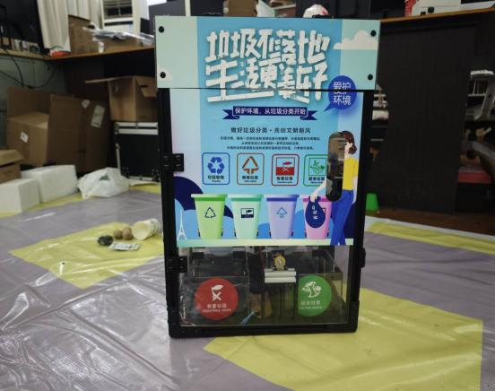
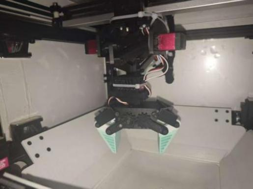
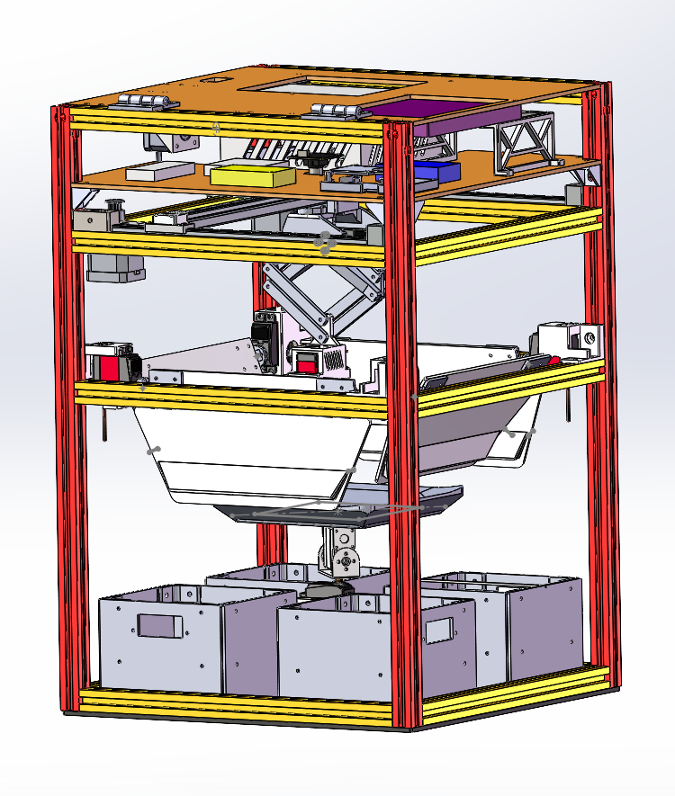

# 第十二届浙江省大学生工程实践与创新能力大赛「智能+」垃圾分类

> 生活智能垃圾分类装置｜机械结构设计、建模与整机调试

## 项目概况

**项目时间：**2025.11 - 2025.12

**项目角色：**队长

**比赛成果：**省级银奖

本项目面向生活垃圾分类场景，设计并制作一套集垃圾识别、分类投放、破袋处理和信息显示于一体的智能垃圾分类装置。我的工作重点是整机机械方案、SolidWorks 建模、机构落地、装配调试和比赛现场协同。

## 个人职责

- 作为队长统筹作品方案、任务流程和团队协作
- 负责整机机械结构设计，并使用 SolidWorks 建立总体装配模型
- 参与设计四分类倾倒机构、Core-XY 搬运平台、伸缩旋转柔性夹爪、感应开盖和破袋装置
- 根据零件功能和修改频率安排铝型材、亚克力板和 3D 打印件的结构组合
- 负责机械装配、机构调试和现场问题处理，协同团队完成整机联调

## 整机机械方案

### 框架与模块布局

装置主体采用铝型材与亚克力板组合搭建，内部按照投放、识别、抓取、分类和收集流程布置多个功能模块。非标准连接件和定制结构件采用 3D 打印制造，便于快速验证和调整装配关系。

整机结构需要同时满足垃圾投放空间、分类机构运动范围、内部维护和垃圾桶拆装要求。底部垃圾桶与主体之间采用磁吸连接，方便取出垃圾桶和进行清洁。

该图展示装置正面的整体布局，包括投放口、分类提示界面、分类桶和主体框架。

### 四分类倾倒机构

单个垃圾分类单元采用上下两个舵机配合倾倒托盘完成投放。下方舵机负责水平转动，上方舵机负责竖直翻转，通过先水平定位、再翻转倾倒的动作顺序，将垃圾送入对应分类桶。固定的动作顺序和倾倒姿态有助于保持投放过程的一致性。

### Core-XY 搬运平台与柔性夹爪

针对一次投入多个垃圾的情况，装置增加 Core-XY 平台和可伸缩的机械夹爪。Core-XY 平台负责在平面内移动夹爪，伸缩机构负责高度调整，末端夹爪通过旋转机构调整姿态，完成垃圾抓取、搬运和释放。

夹爪采用普通 PWM 舵机与 TPU 柔性夹持件组合。柔性夹持件能够更贴合不同形状的垃圾，也降低了夹取过程中舵机因刚性碰撞产生堵转的风险。

该图展示 Core-XY 导轨、伸缩连接结构和 TPU 柔性夹爪，是装置中负责多垃圾搬运的主要末端执行结构。

### 感应开盖与破袋装置

投放口上方设置红外测距模块，用于感知投放区域内是否有垃圾；检测到目标后，由步进电机驱动齿轮齿条结构打开投放口，并由下位机控制关闭时序。

破袋装置采用继电器控制电热丝。处理垃圾袋时，夹爪将垃圾袋移动到电热丝上方完成破袋，使袋内垃圾进入对应分类桶。该机构与 Core-XY 平台和夹爪的运动逻辑联动，扩展了装置的处理流程。

## SolidWorks 建模与制造

我使用 SolidWorks 完成整机装配建模，围绕铝型材框架、亚克力板、分类机构、Core-XY 平台和末端夹爪检查模块之间的安装关系与运动空间。

制造与装配过程中采用以下结构方案：

- 铝型材搭建主体框架，亚克力板形成外部和内部安装面
- 板件与标准件完成主要安装和支撑结构
- 3D 打印件用于柔性夹爪、定制连接件和快速修改的结构件
- 磁吸连接用于垃圾桶快速拆装和维护

该图展示装置的总体 CAD 模型，可以看到多层框架、分类桶、倾倒机构、Core-XY 平台和内部支撑结构的空间关系。

## 机电系统协同

项目采用香橙派 3B 与 STM32H750VBT6 组成上下位机系统：上位机处理摄像头图像和垃圾类别识别，下位机接收分类信息并控制电机、舵机、传感器和执行机构。视觉坐标经过标定后传递给 Core-XY 搬运平台，用于引导夹爪完成目标垃圾的抓取。

我的工作重点在机械系统及其接口落地，负责确认电机、传感器、线缆和执行器在结构中的安装空间，并配合团队完成软硬件联调。

## 调试与结构迭代

装置从总体装配模型进入实物后，围绕以下问题进行调试和调整：

- 检查分类桶、倾倒托盘和外部框架之间的装配与拆装空间
- 调整 Core-XY 平台、伸缩机构和夹爪的运动范围，保证抓取与释放过程顺畅
- 根据不同垃圾形状调整 TPU 柔性夹持件的接触方式
- 检查磁吸连接、机构限位、线缆走线和模块维护空间
- 将现场问题回溯到 SolidWorks 装配模型中，修改结构后重新加工和验证

## 项目成果

- 完成生活智能垃圾分类装置的机械方案、SolidWorks 建模和样机装配
- 完成四分类倾倒机构、Core-XY 搬运平台和柔性夹爪等主要机械模块的落地
- 参与感应开盖、破袋处理、视觉识别和机械动作之间的整机联调
- 作为队长参加第十二届浙江省大学生工程实践与创新能力大赛「智能+」垃圾分类，获得省级银奖

本项目体现了我在团队协作中从任务分析、机械方案和三维建模，到结构制造、整机装配和现场调试的完整工作流程。

## 项目边界

本页面只展示「智能+」垃圾分类装置及我负责的机械工作，不公开原始申报文档、完整源代码、原始 CAD 文件、工程图、内部比赛资料和未核验的性能数据。
