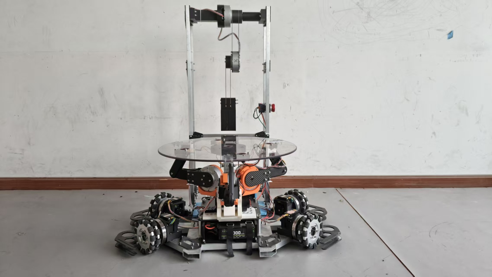

# 2026 ROBOCON 排球机器人挑战赛

> 摆臂击打式发球机构设计与优化

## 项目概况

**项目时间：**2026.03 - 2026.08

**负责模块：**排球机器人发球机构

**比赛成果：**2026 ROBOCON 排球比赛一等奖

本项目面向 2026 ROBOCON 排球机器人挑战赛，重点展示排球机器人的发球机构设计。我的工作集中在发球机构的机械方案、结构建模、样机制造、装配调试和结构优化。

## 个人职责

- 负责发球机构总体机械方案和结构布局
- 使用 SolidWorks 完成发球机构三维建模与装配关系检查
- 负责发球机构相关零件的加工落地、样机装配和现场调试
- 根据发球动作和样机测试现象进行结构调整与迭代
- 配合团队完成排球机器人整机联调

## 发球机构总体方案

发球机构采用摆臂击打式方案，通过摆臂末端与排球接触，将电机输出的运动转化为排球的击打发球动作。相较于固定轨迹的简单推出方式，摆臂结构能够提供连续的击打过程和姿态调整空间，更适合在机器人平台上完成发球动作。

## 双关节串联摆臂结构

发球臂采用双 GO 关节电机串联结构，形成类似“肩关节—肘关节”的双段摆臂。两个关节共同完成发球臂的姿态变化和击球动作：前段关节负责建立摆臂的整体运动趋势，后段关节配合完成末端击球姿态。

这种串联结构的设计重点包括：

- 为摆臂提供足够的运动空间和击球路径
- 保证双关节之间的连接刚度和装配可靠性
- 为电机、线缆和支撑结构预留安装及维护空间
- 通过结构布局减少运动过程中的干涉

## 摆臂击打式发球动作链

```text
排球进入发球位置
    -> 双关节摆臂调整初始姿态
    -> 肩关节与肘关节协同摆动
    -> 末端击球部件接触排球
    -> 排球完成击打发球
```

调试时重点观察摆臂运动是否顺畅、击球位置是否稳定、发球方向是否满足比赛要求，以及连续动作过程中连接件和支撑结构是否可靠。

## 建模、制造与装配

我使用 SolidWorks 建立发球机构的零件和装配模型，围绕电机安装、关节连接、摆臂支撑和末端击球空间检查结构关系。样机落地过程中，根据零件形状、受力和修改频率选择合适的加工方式，并完成发球机构的装配和现场调整。

机械设计与制造流程如下：

```text
比赛动作分析
    -> 发球机构方案设计
    -> SolidWorks 三维建模
    -> 零件拆分与加工规划
    -> 样机加工与装配
    -> 发球测试
    -> 结构迭代与整机联调
```

## 测试与结构迭代

发球机构的优化围绕发球动作的稳定性、方向一致性、击球位置和连续运行可靠性展开。测试中根据实际现象检查摆臂轨迹、关节连接、末端击球姿态和结构干涉，并针对问题修改零件或装配关系。

这部分重点体现机械设计从模型到实物的闭环：先用 SolidWorks 验证结构关系，再通过样机测试发现问题，最后回到零件和装配体中完成迭代。

## 项目展示

### 排球机器人实物总装



该图展示排球机器人整机结构和发球机构所在的安装区域。后续补充发球机构近景图时，可进一步标出双段摆臂、电机、支撑结构和末端击球部件。

## 项目成果

- 完成 2026 ROBOCON 排球机器人的发球机构设计与样机落地
- 完成双 GO 关节电机串联摆臂的装配、调试和结构优化
- 参与排球机器人整机联调
- 获得 2026 ROBOCON 排球比赛一等奖

## 项目边界

本页面只展示 2026 ROBOCON 排球机器人及我负责的发球机构，不公开原始 SolidWorks 文件、工程图、完整 BOM、内部比赛资料和未核验的性能数据。
